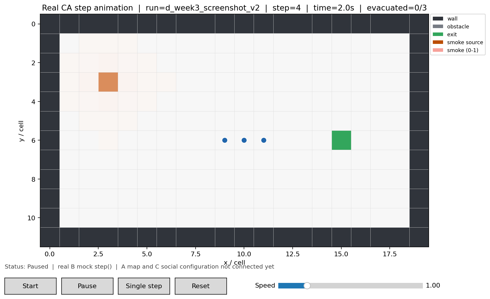

# D 第三周：真实逐步动画与 CSV 日志

## 1. 本周目标

根据项目任务书，第 3—4 周 D 方向进入“仿真动画与 CSV 日志”阶段。

本周实现的最小闭环为：

1. 调用 B 当前 `simulation.ca_model.CaEvacSimulation.step()`；
2. 将上游运行状态转换为 D 端统一快照；
3. 使用 Matplotlib 显示地图、烟雾和人员的真实逐步变化；
4. 提供开始、暂停、单步和重置；
5. 将每名行人的每一步状态写入 `people_log.csv`；
6. 将可确认的撤离事件写入 `event_log.csv`。

这里的“真实”是指动画和日志由 B 当前 CA mock 的实际 `step()` 驱动，不再使用第二周 HTML 中的前端演示运动公式。

## 2. 成果文件

| 文件 | 作用 |
|---|---|
| `visualization/ca_snapshot_adapter.py` | 只读适配 B 当前运行状态，生成 D 标准快照 |
| `visualization/scene_input_adapter.py` | 只读接入 A 的 JSON/CSV Grid 和 C 的 YAML SceneConfig |
| `visualization/visualizer.py` | Matplotlib 地图、烟雾、人员动画及控制按钮 |
| `experiments/csv_logger.py` | 写入逐人逐步日志与事件日志 |
| `experiments/runner.py` | 创建实验、推进仿真、重置和管理日志 |
| `visualization/tests/` | 适配器和界面控制自动测试 |
| `experiments/tests/` | 日志和运行控制自动测试 |
| `docs/d_week3/assets/real_step_animation.png` | 真实第 4 步运行截图 |



## 3. 当前数据流程

```text
B 的 CaEvacSimulation
        ↓ 只读
CaSnapshotAdapter
        ↓ 标准快照
SimulationRunner
        ├─→ MatplotlibSimulationViewer
        └─→ CsvExperimentLogger
              ├─ people_log.csv
              └─ event_log.csv

A 的地图文件可以通过 `visualization.scene_input_adapter.load_map_grid()`
进入 D。该函数仍调用 A 的 loader，只在 D 侧检查尺寸、坐标唯一性和行优先顺序。
`grid_to_static_snapshot()` 可把地图转换为可供 `MatplotlibSimulationViewer`
绘制的地图预览快照；预览不包含人员、烟雾场或仿真事件。

C 的 YAML 可以通过 `load_population_config()` 调用 C 提供的
`SceneConfigGenerator.load_config_from_yaml()`。C 当前交付只包含场景参数，
没有 persons/relations 生成接口，因此 D 不会自行补造人员或关系。
```

D 只负责读取、适配、显示和记录，不修改 A、B、C 的模型逻辑。

## 4. 运行方式

在仓库根目录运行：

```powershell
python -m experiments.runner
```

默认参数：

- `time_step = 0.5 s`；
- 最大 500 步；
- 随机种子 42；
- 日志保存到 `outputs/d_week3/<run_id>/`。

无窗口运行并只生成日志：

```powershell
python -m experiments.runner --headless
```

也可以指定参数：

```powershell
python -m experiments.runner `
  --time-step 0.5 `
  --max-steps 500 `
  --interval-ms 300 `
  --random-seed 42
```

## 5. 界面控制

- `Start`：连续调用真实 `step()`；
- `Pause`：停止定时推进；
- `Single step`：只推进一个仿真步；
- `Reset`：重新创建场景和仿真实例，并开始一个新的日志目录；
- `Speed`：改变播放间隔，不改变仿真时间步长。

B 当前没有公开的 `reset()`。因此 D 不直接篡改 B 内部状态，而是通过工厂函数重新创建场景和仿真实例。

## 6. 输出日志

### 6.1 `people_log.csv`

每名行人在每个时间步对应一行，当前字段包括：

```text
run_id,schema_version,scenario_id,random_seed,
step,time_step_s,time_s,
person_id,x,y,heading,status,target_exit,actual_exit,evacuated,
smoke_concentration,risk,dose,
info_state,info_source,receive_time,follow_target
```

当前上游没有提供的 `heading`、`risk`、`dose`、信息状态等字段保留为空，不填入演示值。

已经撤离的行人继续记录到仿真结束。

### 6.2 `event_log.csv`

当前可可靠记录：

```text
evac_success
```

该事件由 D 根据撤离状态从 `false` 变为 `true` 的变化生成，每名行人只记录一次。

当前不能可靠生成 `conflict` 和 `exit_switch`，因为 B 尚未公开这两类事件。D 不把“原地不动”误判为冲突。

## 7. 当前接口状态

### 7.1 已直接接入

- A 的 JSON 地图：已验证 `simple_room.json` 和 `classroom_corridor.json`；
- A 的 CSV 地图：D 适配器支持并拒绝非稠密、非行优先输入；
- A 的 `core.grid.Grid` 到 D 地图预览快照；
- C 的 YAML 到只读 `SceneConfig` 参数视图；
- B 当前 mock 地图；
- B 当前人员坐标；
- B 当前烟雾矩阵；
- B 当前 `step()` 与 `all_done()`；
- B 当前撤离状态的临时只读回退。

### 7.2 需要适配后接入

- C 的 `SceneConfig` 到正式 persons / relations / `ScenarioConfig`；
- B 后续公开的人员朝向、风险、剂量、拥堵和事件快照；
- C 后续公开的关系图与信息传播状态。

### 7.3 仍待团队确认

- B 的正式入口是 `ca_model.py` 还是 `evac_simulation.py`；
- B 是否提供公开快照和撤离状态 API；
- 二维场索引顺序是否最终固定为 `[y][x]`；
- A 地图的坐标原点与方向；
- A 的 CSV 行优先保证和 `upload.py` 的正式函数命名；
- A 地图烟源、出口附加信息如何进入 `ScenarioConfig`；
- C 配置生成后的人员编号、比例分配和关系强度口径；
- `conflict`、`exit_switch` 等事件的正式输出格式。

当前检查还发现：

- A 的 CSV loader 按文件行顺序追加元胞，而 B 当前按
  `cells[y * width + x]` 读取；接入前必须确认 CSV 已按行优先完整排列，
  或由 A 的 loader 统一排序；
- C 当前关系图人员编号为 `0...N-1`，而团队 D schema 约定为正整数；
  在团队决定由 C 改为 `1...N` 或提供统一映射前，D 不擅自重编号；
- C 当前角色比例采用随机抽样，不保证 40 人按 0.9 / 0.1 精确得到
  36 / 4，`relation_intensity` 是否参与关系生成也仍待 C 确认。

## 8. 临时兼容说明

当前 B 没有公开撤离状态，适配器临时只读：

```text
simulation._evacuated_status
```

这属于第三周兼容层，不是长期接口。等 B 提供公开状态后，只需替换适配器读取方式，不需要修改动画和日志模块。

当前优先使用：

```text
simulation.evac_simulation.CaEvacSimulation
```

原因是该版本会处理冲突求解结果为 `None` 的情况；另一个同名实现仍需 B 确认。

## 9. 自动测试

运行：

```powershell
python -B -m unittest discover -v
```

也可以按模块分别运行：

```powershell
python -B -m unittest discover -s visualization/tests -p "test_*.py" -v
python -B -m unittest discover -s experiments/tests -p "test_*.py" -v
```

当前测试覆盖：

- 初始快照和单步时间换算；
- 烟雾场尺寸与人员所在元胞烟雾值；
- 人员 ID 唯一与全员撤离后继续输出；
- 非稠密、非行优先 Grid 的拒绝；
- people / event CSV 的列、行数和空值；
- 撤离事件去重；
- 整个时间步先校验和序列化、再写入，避免半步日志；
- 人员集合固定、撤离状态不可回退、撤离后坐标固定；
- 时间不一致的拒绝；
- 随机种子、人员编号、事件人员和未知元胞类型检查；
- 单步、重置、独立日志目录；
- Matplotlib 无窗口绘制、按钮状态和截图保存。

## 10. 当前边界

- A 的 JSON/CSV 已接入 D 地图预览适配层，但尚未组成 B 可运行场景；
- C 的 YAML 参数已接入 D 只读视图，但 persons/relations 尚未接入；
- 尚未接入 B 的正式公开快照；
- 当前快照仅部分兼容 `0.1-draft`：B 未提供的必填 `heading`
  暂时为空，并已在日志和说明中明确保留；
- 没有修改 `core/`、`map_import/`、`simulation/`、`social/` 或其他成员文件；
- 当前小场景用于验证 D 的第三周动画与日志链路，不代表完整平台联调完成；
- `docs/d_week3/examples/d_test_population.json` 是明确标记为 `D_TEST` 的临时人员/关系数据，不是 C 正式输出；
- 使用 40 人 D_TEST 人群进行端到端运行时，发现 B 的冲突消解结果可能为 `None`，而 `simulation/evac_simulation.py` 尚未跳过该结果，D 不绕过或修改 B 的移动逻辑。
