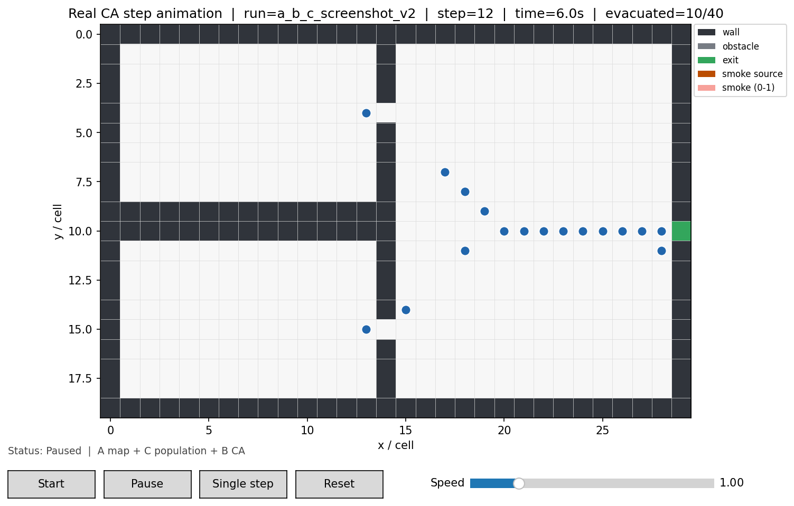

# D 第四周：初步可运行联合版本

## 目标

本版本不再把示范场景写死在 D 的页面中。它接收符合团队当前约定的外部输入，并将 A、B、C 的现有成果接成一条可运行链路：

```text
A 的 JSON/CSV 地图
    -> A loader / D 校验
C 的 output_people.json（可选 YAML）
    -> D 场景组装
B 的 EvacEngine.run_one_step(c_step_data)
    -> D 动画、people_log.csv、event_log.csv
```

## 支持的输入

```powershell
python -m experiments.integrated_runner `
  --map <任意合规的地图.json或.csv> `
  --population <任意合规的output_people.json> `
  --yaml <可选的config_template.yaml> `
  --headless
```

地图必须由 A 的 JSON/CSV loader 支持，并满足稠密行优先规则。人口 JSON 必须包含 `persons` 和 `relations`，且关系端点必须引用已有人员。

## 当前自动组装规则

- A 地图中的 `type=exit` 自动成为出口；
- A 地图中的 `type=smoke_source` 自动成为烟源；
- C 当前输出为 0-based ID，D 映射为 1-based ID 并保留原始 ID；
- 若 C 人员坐标缺失、重叠、落在不可通行元胞或越界，D 使用随机种子将其无重叠放在 A 地图的 `free/sign/guide_zone` 元胞；
- 若 C 后续给出有效且互不重叠的坐标，D 保留 C 原坐标；
- 当前地图没有 `smoke_source` 时仍可跑疏散，但不会产生烟雾场；这不是 D 自行补造烟源。

## 临时兼容说明

B 当前冲突求解器把冲突失败表示为 `None`，其含义是“原地等待”；但 B 当前 `step()` 会把 `None` 当坐标解包。D 的运行包装层只在内存中将该结果恢复为原坐标，随后立即还原 B 的函数，不修改 B 源代码。

该兼容层会在 B 修复公开 `step()` 后移除。`heading`、`risk`、`dose`、`conflict`、`exit_switch` 等 B 尚未给出的数据仍保留为空，不以演示值代替。

## 当前边界

- 本版已使用 C 的人员属性和关系作为真实输入，并使用 B 的 CA 步进与烟雾模型；
- C 的关系目前可随快照输出和展示，但 B 当前 CA 尚未把关系、信息传播或从众行为用于移动决策；
- 这是一版可运行的 A+B+C 初步联调，不代表社会传播和风险模型已经完整影响行人决策；
- D 只新增适配、运行、展示和日志代码，不改动 A/B/C 文件。

## 已验证的初步联调

使用仓库当前实际文件完成了无窗口运行检查：

- A：`scenarios/classroom_corridor.json`（30 x 20，1 个出口）；
- C：`social/output_people.json`（40 人、160 条关系）与
  `control/config_template.yaml`；
- B：`simulation.evac_simulation.EvacEngine.run_one_step(c_step_data)`；
- D：第 0 到第 20 步均生成每步 40 行的 `people_log.csv`，并在第 12 步
  正确显示 10/40 人已撤离。

该地图当前没有 `smoke_source`，因此本次验证没有烟雾扩散图层；换成带烟源
的合规地图后，B 的现有烟雾模型会随同一条流程运行。


